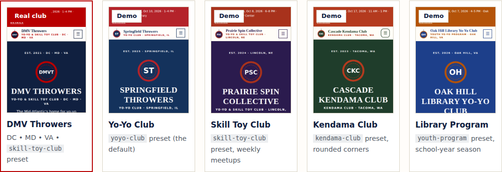

# Yo-Yo & Skill Toy Club Website Template

A free, fast, mobile-friendly website for a **yo-yo, kendama, diabolo, spin top, or juggling club, a
mixed skill toy meetup, or a school or library program**. Edit one settings file, and GitHub builds
and publishes the site for you. No coding, servers, or monthly fees.



- **Cost:** $0 on GitHub Pages. An optional custom domain like `springfieldthrowers.org` is about $10–20/year.
- **Time:** about 15–30 minutes from "Use this template" to a live site.
- **Skills:** you can edit a text file in your web browser. An AI coding agent can do the whole thing (see [AGENTS.md](AGENTS.md)).
- **License:** [Unlicense](LICENSE), public domain. Copy, change, and share it however you like.
- **See it first:** the [showcase and deploy guide](https://dmvthrowers.club/yoyoclub-template/) has live examples, including the real club this template came from, [DMV Throwers](https://dmvthrowers.club/).

**What you get:** 11 pages (Home, About, Meetups, Learn, Team, Gallery, Resources, FAQ, Contact,
Code of Conduct, Privacy & Safety) plus a "page not found" page.

- **Meetups that schedule themselves.** Describe your rule once, like "3rd Sunday, 1–4 PM" or
  "every other Thursday". The site lists the next dates, shows a **next meetup** bar on every page,
  and rebuilds every morning so it's never out of date. Add skip dates for holidays.
- **A Learn page** for your toys: first steps, a trick path, trusted tutorial links, and yo-yo contest styles (1A–5A) if you throw.
- **Made for what you play.** Pick a preset, or list your toys (`"toys": ["yo-yo", "kendama"]`) and the
  wording, Learn page, FAQ, safety notes, and logo follow ("loaner yo-yos and kendamas").
- **A code of conduct** written for skill toy meetups, including equipment safety.
- **Shops and sponsors** with discount-code boxes, plus a donate button.
- **Every meetup is an event Google understands**, and the FAQ shows up in search results too.

Every page works on phones and is accessible (contrast, tap targets, keyboard). It's privacy-friendly
(no cookies, trackers, or outside fonts) and locked down with a strict security policy. An automatic
check catches mistakes before they go live. The look comes from the DMV Throwers site: square corners,
flat cards, serif headings, and a bold top bar, in your colors.

---

## Quick start (15–30 minutes)

You need a free [GitHub account](https://github.com/signup).

### 1. Make your own copy
Click the green **Use this template** button at the top of this page, then **Create a new
repository**. Give it a name (for example `springfield-throwers`), keep it **Public**, and click **Create repository**.

> Public is required for free GitHub Pages hosting. Nothing private goes in this repository; it's
> the same information that's on your public website.

### 2. Turn on GitHub Pages
In your new repository: **Settings → Pages → Build and deployment → Source → GitHub Actions**.
That's the only setting you need.

### 3. Fill in your details
Open **`site.jsonc`**, click the **pencil icon** to edit, and work top to bottom. Every line has a note.

1. **`preset`**: pick your kind of club:

   | Preset | For | Learn page shows |
   | --- | --- | --- |
   | `yoyo-club` (default) | A yo-yo club | Yo-yo basics, a 3-level trick path, 1A–5A contest styles |
   | `kendama-club` | A kendama club | Kendama basics and a trick ladder |
   | `diabolo-club` | A diabolo club | Starting and spinning, a trick path, and space and ceiling-height safety |
   | `spintop-club` | A spin top (throw top) club | Winding and throwing, a trick path, and hard-floor and throwing safety |
   | `juggling-club` | A juggling and flow arts club (balls, clubs, rings, poi, staff, hoop) | Cascade basics, a trick path, flow props, and a no-fire rule |
   | `skill-toy-club` | Yo-yos plus kendama, spin tops, diabolo, juggling, flow arts | First tricks for each toy |
   | `youth-program` | A yo-yo program at a school, library, camp, or rec center | A printable trick checklist, tips for teachers, stricter kid-safety rules |

   **`toys`**: what you play. Leave it `[]` to use the preset's toys. If your mix is different, list
   it, for example `["kendama", "spin-top"]`. The Learn page, FAQ, loaner and safety text, code of
   conduct, and logo are then written for exactly those toys ("loaner kendamas and spin tops").
   Known toys: `yo-yo`, `kendama`, `spin-top`, `diabolo`, `juggling`, `flow-arts`. Any other name
   works too, with plain wording (the build tells you).

2. **`club`**: name, tagline, slogan, city, area, short description.
3. **`meetup`**: your repeating schedule, venue, address, and whether you bring loaners.
   See [Meetup dates](#meetup-dates).
4. **`contact`** and **`cost`**: a shared email address, social links, a donate link, and whether meetups are free.
5. **`officers`**: only people who agreed to be listed. `"open": true` shows a "volunteer for this role" card.
6. **`events`**: workshops, contests, demos. Dates as `YYYY-MM-DD`. Past events disappear automatically.

When you're done, click **Commit changes**.

> **Shortcut:** the [`examples/`](examples/) folder has finished settings files.
> `dmv-throwers.jsonc` is a real club. Copy one over `site.jsonc` and change the details.

### 4. Watch it go live
Open the **Actions** tab. "Build and deploy" takes about a minute. When it shows a green check,
your site is live at:

```
https://YOUR-GITHUB-NAME.github.io/YOUR-REPO-NAME/
```

The link also appears on the finished run and under **Settings → Pages**.

**Did the first run fail?** If the repository was created before you turned on Pages, the very
first run fails. Go to **Actions → Build and deploy → Run workflow** to run it again.

**A red X on a later run** means the automatic check found a problem, such as a typo in
`site.jsonc` or a missing photo. Click the run to see a plain-English message. Your live site
stays as it was until the problem is fixed.

---

## Meetup dates

Set the rule once in `site.jsonc` → `meetup.schedule`. Times are 24-hour (`"13:00"` is 1 PM).

| You meet… | Set |
| --- | --- |
| Every 3rd Sunday, 1–4 PM | `{ "repeat": "monthly", "week": 3, "weekday": "Sunday", "start": "13:00", "end": "16:00" }` |
| The last Saturday of the month | `{ "repeat": "monthly", "week": "last", "weekday": "Saturday", ... }` |
| Every Thursday, 6–8 PM | `{ "repeat": "weekly", "weekday": "Thursday", "start": "18:00", "end": "20:00" }` |
| Every other Saturday | `{ "repeat": "weekly", "every": 2, "from": "2026-10-03", "weekday": "Saturday", ... }` (`from` is one real meetup date) |
| Only during the school year | add `"months": [9, 10, 11, 12, 1, 2, 3, 4, 5]` |
| No regular schedule | `{ "repeat": "none" }`, and list each date in `events` |

- **Skipping a date** (holiday, venue closed): add `{ "date": "2026-12-20", "note": "Holiday break" }`
  to `meetup.skip`. The Meetups page shows the note instead.
- **Moving a meetup:** skip the usual date with a note like "Moved to Dec 13", and add the new date to `events`.
- **Time zone:** set `site.timezone` (for example `"America/Chicago"`) so the next meetup flips over on the right day.
- The site rebuilds **every day** at 07:23 UTC (early morning in the Americas), so the next meetup bar moves on by itself.
  You never have to edit dates by hand.

---

## What to change (and where)

| To change… | Edit | Notes |
| --- | --- | --- |
| Name, tagline, slogan, area, description | `site.jsonc` → `club` | |
| Meetup schedule, venue, address, loaners | `site.jsonc` → `meetup` | Use a public place. Don't publish home addresses. |
| Email, social links, donate button | `site.jsonc` → `contact` | Use a shared email (free with Gmail). Avoid personal cell numbers. |
| Cost | `site.jsonc` → `cost` | Plain text, so any currency works. |
| Officers and volunteers | `site.jsonc` → `officers` | Ask before listing anyone. |
| Workshops, contests, demos | `site.jsonc` → `events` | `"featured": true` puts one on the home page. |
| Shops and sponsors | `site.jsonc` → `partners` | `"code"` shows a discount code box. |
| Charter, guides, checklists | `assets/documents/` + `site.jsonc` → `documents` | `"about": true` also shows it on the About page. |
| What you play | `site.jsonc` → `"toys": ["yo-yo", "kendama"]` | Rewrites the toy wording, Learn page, FAQ, and safety text. See step 3. |
| The tags under "About us" | `site.jsonc` → `"disciplines": ["Yo-Yo", "Kendama"]` | |
| Colors and corners | `site.jsonc` → `theme` | Any hex color. `"corners"`: `sharp`, `soft`, or `round`. The build warns if text would be hard to read. |
| Logo | add `assets/emblem.svg` | Otherwise a logo with your initials (`club.short_name`) is generated, shaped like your first toy: a yo-yo, kendama, top, diabolo, or juggling balls. Pick another with `theme.emblem`. |
| Social-share image | add `assets/og-card.png` (1200×630) | Otherwise one is generated in your colors. |
| Photos | `assets/images/gallery/` + `site.jsonc` → `gallery` | See [Photos](#photos-and-privacy). |
| Extra links on Resources | `site.jsonc` → `links`, `sister_clubs` | |
| Extra FAQ questions | `site.jsonc` → `faq_extra` | `"group"` puts it under a heading. |
| Trick lists, Learn page, FAQ, code of conduct, safety text | `presets/<your preset>.json` | Or copy any section into `site.jsonc` to override it. |
| A whole extra section on a page | `content/<page>.html` | See [Adding your own content](#adding-your-own-content). |
| Page layout or new pages | `build.py` | One short function per page. |
| Fonts, spacing, look | `assets/style.css` | |
| Footer template credit | `site.jsonc` → `site.credit` | Small "Site template by" line. Set `false` to hide it; no credit is required. |

**Overriding preset text:** anything in `site.jsonc` wins over the preset. For example, to change
the trick path, add a `"learn": { "levels": [ ... ] }` section to `site.jsonc` in the same shape as in
`presets/yoyo-club.json`.

---

## Photos and privacy

1. **Ask first.** Get permission before posting photos of people, and written permission from a
   parent or guardian for any child. Honor anyone who says no.
2. **Never name kids** in captions or alt text ("Kids practicing tricks", not names).
3. **Resize and clean photos** before uploading: about 1200 pixels wide and under 500 KB. Strip the
   location data. On most phones, turn off location in the share options, or use a free tool such
   as [Squoosh](https://squoosh.app) in your browser.
4. Upload to `assets/images/gallery/` (**Add file → Upload files** on GitHub), then list each one in `site.jsonc`:

   ```jsonc
   "gallery": [
     { "src": "images/gallery/meetup.jpg", "alt": "Players practicing yo-yo tricks in a library room", "caption": "October Meetup" }
   ]
   ```

The **Privacy & Safety** page tells visitors these rules and how to ask for a photo to be removed.

---

## Google Calendar (optional)

1. In Google Calendar, make a calendar for your club, then open **Settings and sharing**.
2. Under **Access permissions**, check **Make available to public** (see all event details).
3. Under **Integrate calendar**, copy the URL from inside the **Embed code** (it starts with
   `https://calendar.google.com/calendar/embed?src=`).
4. Paste it into `site.jsonc` → `"calendar": { "embed_url": "..." }`.

It shows under the meetup list. You don't need it: the meetup dates are generated either way.

---

## Adding your own content

Make a file named after a page in the `content/` folder: `content/about.html`,
`content/index.html` (home), `content/meetups.html`, and so on. Its HTML is added as a new section at
the bottom of that page. Use plain HTML tags like `<h2>`, `<p>`, `<ul>`, and `<a>`. Inline
`<script>`, `<style>`, and `style="…"` are blocked by the security policy, and the automatic check
will flag them. Put styles in `assets/style.css` instead. See [content/README.md](content/README.md).

---

## Custom domain (optional, about $10–20/year)

1. Buy a domain from any registrar (Cloudflare, Namecheap, Porkbun, Google/Squarespace…).
2. In your repository: **Settings → Pages → Custom domain**. Enter it and click **Save**.
3. At your registrar, add the DNS records GitHub shows you:
   - for `springfieldthrowers.org`: four `A` records pointing to 185.199.108.153, 185.199.109.153,
     185.199.110.153 and 185.199.111.153
   - for `www`: a `CNAME` to `YOUR-GITHUB-NAME.github.io`
4. When the check turns green, tick **Enforce HTTPS**.
5. Run **Actions → Build and deploy → Run workflow** so the site picks up its new address.

---

## Other ways to deploy

The site is plain files. Anything that can run `python3 build.py` and serve the `_site/` folder works.

| Host | Build command | Output folder | Notes |
| --- | --- | --- | --- |
| **GitHub Pages** (default) | automatic | automatic | Free for public repositories. Rebuilds daily. |
| Cloudflare Pages | `python3 build.py` | `_site` | Free. Set the env var `SITE_URL`. Add a daily deploy hook to keep dates fresh. |
| Netlify | `python3 build.py` | `_site` | Free tier. Set `SITE_URL`. Add a daily build hook. |
| Any web host / USB stick | run `python3 build.py` on your computer | upload `_site/` | Set `site.url`. Rebuild after each meetup. |

**Preview on your own computer** (needs [Python 3](https://www.python.org/downloads/)):

```sh
python3 build.py --serve                # then open http://localhost:8000/
python3 build.py --today 2026-12-21     # see what the site looks like on another day
python3 scripts/check_site.py
```

---

## Outside the US

| What | Where |
| --- | --- |
| Page language | `site.jsonc` → `site.language` (e.g. `"fr"`, `"es"`, `"ja"`) |
| Date and time style | `site.jsonc` → `site.date_format`: `"us"` (Sun, Oct 18, 2026 · 1–4 PM) or `"intl"` (Sun 18 Oct 2026 · 13:00–16:00) |
| Time zone | `site.jsonc` → `site.timezone`, e.g. `"Europe/London"` |
| State or province | `site.jsonc` → `club.region` and `club.area` (any text) |
| Money | `site.jsonc` → `cost` is free text |
| Page wording (buttons, headings) | in English in `build.py`. Search for the text and translate it |
| Month and day names | `MONTHS`, `MONTHS_FULL`, `DAYS`, and `DAYS_FULL` near the top of `build.py` |

To add a new preset, copy `presets/yoyo-club.json` to `presets/my-preset.json`, edit it (including
its `"toys"`), and set `"preset": "my-preset"` in `site.jsonc`. To add a toy, add an entry to
`presets/_toys.json`: its words, logo shape, starter card, first tricks, links, and one safety line.
In any text, `{toys}` becomes your toys ("yo-yos and kendamas"), `{toy}` the short form ("yo-yo and
kendama", or "skill toy" for three or more), and `{Toy}` the title form ("Yo-Yo & Kendama").

---

## Make it better (optional add-ons)

- **Contact form.** [Formspree](https://formspree.io) (free tier) or a Google Form linked from the Contact
  page. An embedded form also needs its address added to `form-action` / `frame-src` in `csp()` in `build.py`.
- **Player map.** Point people to a city-level map like the [YoYo Map](https://map.dmvthrowers.club/) in `links`.
- **Contest sign-up.** Link your registration form from `events[].url`.
- **"Subscribe to our calendar" link.** Add your public Google Calendar's iCal link to `links`.
- **Shared photo albums.** Link a Google Photos album instead of uploading many photos.
- **Two-person review.** **Settings → Rules → Rulesets**: require a pull request and the "Build and
  deploy" check before changes reach `main`, so a second organizer approves each change.
- **More pages.** Copy a `page_…` function in `build.py`, give it a new name, and add it to `self.pages`.
- **Visitor counts.** Only if you really need them. Prefer a privacy-friendly service, and update
  the Privacy page and the security policy (`connect-src` / `script-src`) to match.

---

## Safety, security, and trademarks

- **Built-in safety:** no tracking, cookies, or forms, so the site collects nothing from visitors.
  A strict security policy allows only this site's own files, plus Google Calendar if you add one.
  The automatic check rejects inline scripts, insecure links, missing alt text, and broken links.
  The GitHub Actions it uses are pinned to exact versions and kept current by Dependabot.
- **Turn on two-factor login** for your GitHub account. Whoever controls the account controls the site.
- **Trademarks:** brand names in the presets (shops, apps, leagues) are used only to link to their
  sites. This template includes no brand logos and isn't affiliated with or endorsed by any yo-yo,
  kendama, juggling, or skill toy company, league, or shop.
- **Links change.** The preset links were checked in October 2026. Fix any that break in your preset file.

---

## Files

```
site.jsonc              ← your settings (start here)
presets/                ← starting text for each kind of club
  yoyo-club.json  kendama-club.json  diabolo-club.json  spintop-club.json
  juggling-club.json  skill-toy-club.json  youth-program.json
  _toys.json            ← the toy library: words, logo, and starter tips for each toy
assets/                 ← copied to the site as-is
  style.css             ← look and layout (colors come from site.jsonc)
  site.js               ← phone menu (the only script)
  images/gallery/       ← your photos
  documents/            ← your PDFs and other downloads (create it)
content/                ← optional extra HTML for any page
build.py                ← builds _site/ from all of the above (standard Python, no installs)
scripts/check_site.py   ← checks the built site (links, accessibility, security)
.github/workflows/deploy.yml  ← builds, checks, and publishes on every change, plus daily
AGENTS.md               ← instructions for AI coding agents
examples/               ← finished settings files to copy (a real club plus demos)
showcase/, scripts/build_showcase.py  ← the template's own showcase page (safe to delete in your copy)
```

Pull requests with improvements, new presets, or translations are welcome.

**Running a contest?** Use the sister template,
[yoyo-contest-template](https://github.com/dmvthrowers/yoyo-contest-template), for a contest's own
site (divisions, schedule, rules, venue, sponsors, results). Clubs and contests are separate
templates because they rarely share the same organizers, dates, or audience.
For Scout units and kids clubs: [Scouts-Template-Site](https://github.com/dmvthrowers/Scouts-Template-Site).

## Words you'll see

| Word | Plain meaning |
| --- | --- |
| **JSONC** | A settings file that allows `//` comments, so every setting can explain itself |
| **GitHub Actions** | GitHub's free robot. It builds and checks your site every time you save a change |
| **GitHub Pages** | GitHub's free web hosting for the site the robot builds |
| **CSP** | Content Security Policy: a rule in each page that only lets it load its own files |
| **Preset** | A ready-made set of defaults (colors, wording) you start from and then change |

## The family

These templates share one look, one way of working, and one checklist. Pick the one that fits.

| Template | Use it for |
| --- | --- |
| [yoyoclub-template](https://github.com/dmvthrowers/yoyoclub-template) | A club website: meetups, team, gallery, FAQ |
| [yoyo-contest-template](https://github.com/dmvthrowers/yoyo-contest-template) | A contest website: schedule, divisions, sponsors, results |
| [Scouts-Template-Site](https://github.com/dmvthrowers/Scouts-Template-Site) | A Scout pack or troop, Girl Scout troop, or kids club website |
| [yoyo-map-template](https://github.com/dmvthrowers/yoyo-map-template) | A city-level community map with privacy built in |
| [yoyo-registration-template](https://github.com/dmvthrowers/yoyo-registration-template) | Contest registration, payments and day-of tools (Next.js, Stripe, Supabase) |
| [yoyo-player-map](https://github.com/dmvthrowers/yoyo-player-map) | The full player map app behind map.dmvthrowers.club |
